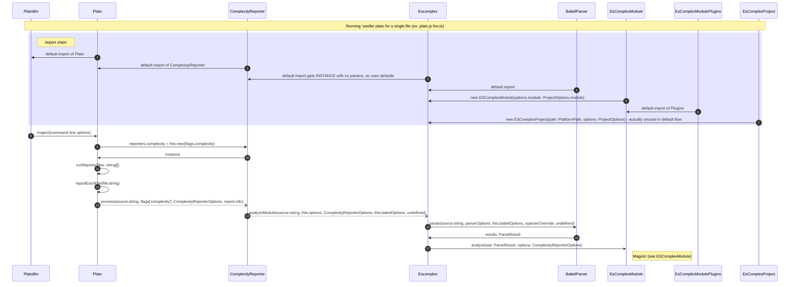

Ponticus is (will be) broken into 4 main concerns:
1. cli - interactive command line app to run complexity analysis on specific desired inputs
2. analysis - processes source code and produces raw coplexity analysis
3. reporting - converts raw analysis into formatted output, JSON, XML, etc.
4. ui - interactive apps for humans to navigate and process complexity analysis

Each of these is further subdivided into more specific areas of concern where appropriate.
For example, the analyzer has (will have) sections about parsing files and quantifying complexity.

The standard way to use Ponticus is to use the cli to generate the data for a UI.
That's how the [Report](https://gabrielcsapo.github.io/ponticus/report/) is generated:
1. the cli is used to generate the data
2. the standard web UI consumers the data

## Historical Context
This is a hard fork of an existin gproject, so its important to understand (for now) htf things "work", so we can make changes.
This is a hard fork, so we'll start by understanding the initial implementation.

The following diagram(s) demonstrate how we get from running `node plato.js -f foo.ts` on the commandline to an output report file.
The UI is much less important since we mostly care about how he data is generated and what it looks like.

### Up To Analysis
I know, we need the zoom capability.

### Analysis (coming soon)